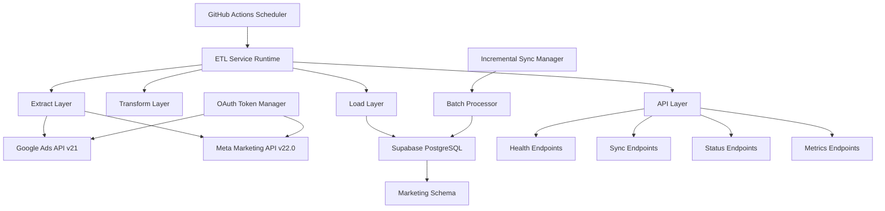
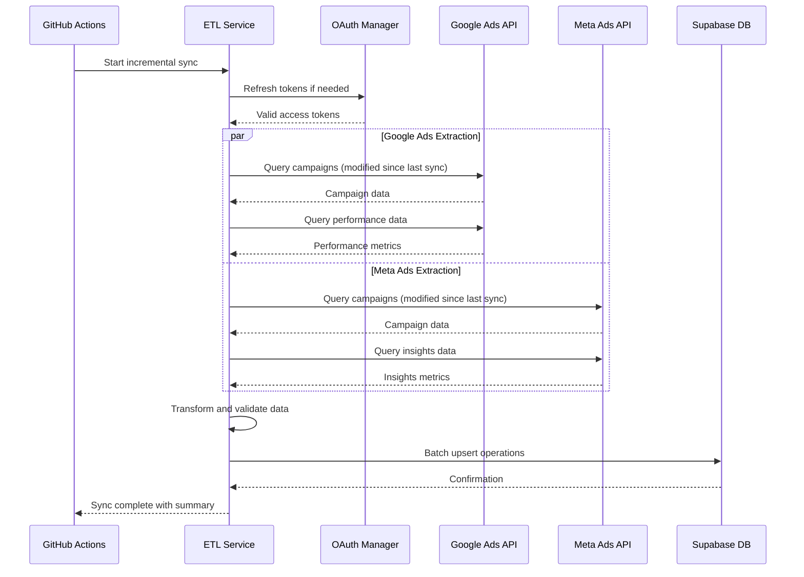
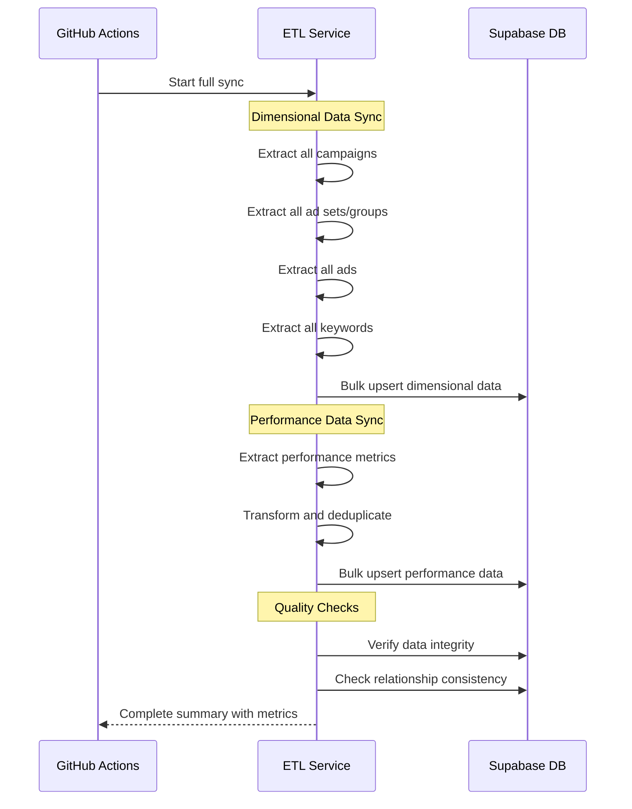
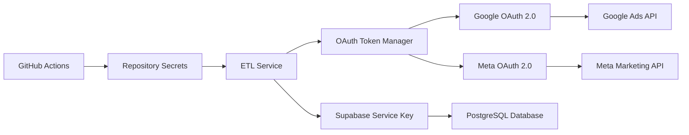
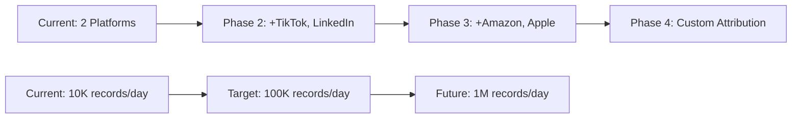

# System Architecture Overview

The Lengolf Ads ETL Service is designed as a modern, cloud-native data pipeline that efficiently extracts, transforms, and loads advertising data from multiple platforms.

## 🏗️ High-Level Architecture



## 🔧 Core Components

### 1. **Scheduler Layer (GitHub Actions)**
- **Purpose**: Automated workflow orchestration
- **Frequency**: Every 2 hours (incremental) + Daily (full sync)
- **Features**: 
  - Zero-cost serverless execution
  - Built-in retry and error handling
  - Manual trigger capabilities
  - Environment isolation

### 2. **ETL Service Runtime (Node.js/Express)**
- **Purpose**: Main application logic and API endpoints
- **Technology**: TypeScript, Express.js, Node.js 20
- **Features**:
  - RESTful API interface
  - Health monitoring
  - Comprehensive logging
  - Error handling and recovery

### 3. **Extract Layer**
- **Purpose**: Data extraction from advertising platforms
- **Components**:
  - Google Ads Client (Google Ads API v21)
  - Meta Ads Client (Meta Marketing API v22.0)
  - OAuth Token Manager
  - Rate limiting and retry logic

### 4. **Transform Layer**
- **Purpose**: Data normalization and enrichment
- **Functions**:
  - Schema mapping and validation
  - Data type conversion
  - Relationship linking
  - Quality checks and deduplication

### 5. **Load Layer**
- **Purpose**: Efficient database operations
- **Components**:
  - Batch Processor (bulk operations)
  - Incremental Sync Manager
  - Conflict resolution
  - Performance optimization

### 6. **Storage Layer (Supabase)**
- **Purpose**: Persistent data storage and access
- **Technology**: PostgreSQL with Supabase extensions
- **Features**:
  - Marketing schema for ads data
  - Real-time subscriptions
  - Row-level security
  - Automatic backups

## 📊 Data Flow Architecture

### Incremental Sync Flow



### Full Sync Flow



## 🔄 Sync Strategies

### 1. **Incremental Sync**
- **Frequency**: Every 2 hours
- **Method**: Modified-since timestamps
- **Data**: Recent changes only
- **Benefits**: Fast execution, minimal API calls
- **Use Case**: Regular updates for fresh data

### 2. **Full Sync**
- **Frequency**: Daily (2 AM UTC)
- **Method**: Complete data refresh
- **Data**: All entities and relationships
- **Benefits**: Data consistency, gap filling
- **Use Case**: Quality assurance, historical backfill

### 3. **Emergency Sync**
- **Frequency**: Manual trigger
- **Method**: Custom date ranges and filters
- **Data**: User-specified scope
- **Benefits**: Flexible recovery options
- **Use Case**: Issue resolution, historical data retrieval

## 🏛️ Database Architecture

### Schema Design

```sql
-- Marketing Schema Structure
marketing/
├── Platform Tables
│   ├── google_ads_campaigns
│   ├── google_ads_ad_groups  
│   ├── google_ads_ads
│   ├── google_ads_keywords
│   ├── meta_ads_campaigns
│   ├── meta_ads_ad_sets
│   └── meta_ads_ads
├── Performance Tables
│   ├── google_ads_campaign_performance
│   ├── google_ads_keyword_performance
│   ├── meta_ads_campaign_performance
│   └── meta_ads_adset_performance
├── Creative Assets
│   └── ad_creative_assets
├── Management Tables
│   ├── platform_tokens
│   ├── etl_sync_log
│   └── sync_state
```

### Key Design Principles

1. **Separation of Concerns**: Dimensional vs. performance data
2. **Referential Integrity**: Foreign key relationships maintained
3. **Conflict Resolution**: Composite primary keys for performance tables
4. **Audit Trail**: Created/updated timestamps on all tables
5. **Scalability**: Indexed on common query patterns

## 🔐 Security Architecture

### Authentication Flow



### Security Layers

1. **Transport Security**: HTTPS for all API communications
2. **Authentication**: OAuth 2.0 with refresh tokens
3. **Authorization**: Service account with minimal permissions
4. **Storage Security**: Encrypted database connections
5. **Secret Management**: GitHub repository secrets
6. **Network Security**: No persistent storage of credentials

## 📈 Performance Architecture

### Optimization Strategies

1. **Batch Processing**: Bulk database operations
2. **Connection Pooling**: Efficient database connections
3. **Caching**: Token caching and API response optimization
4. **Rate Limiting**: Respectful API usage patterns
5. **Parallel Execution**: Concurrent platform processing
6. **Incremental Loading**: Change-based synchronization

### Resource Management

```yaml
# GitHub Actions Resources
Memory: 7GB per runner
CPU: 2 cores
Storage: 14GB SSD
Network: High-speed internet
Timeout: 6 hours maximum per job

# Database Resources  
Connection Pool: 25 connections max
Query Timeout: 30 seconds
Memory: Shared buffer optimization
Indexes: Strategic performance indexing
```

## 🔍 Monitoring Architecture

### Observability Stack

1. **Application Metrics**:
   - Sync success/failure rates
   - Record processing counts
   - API response times
   - Error frequencies

2. **Infrastructure Metrics**:
   - GitHub Actions execution time
   - Database connection health
   - Memory and CPU usage
   - Network latency

3. **Business Metrics**:
   - Data freshness indicators
   - Platform coverage metrics
   - Data quality scores
   - Cost per sync operation

### Health Check System

```typescript
interface HealthCheck {
  status: 'healthy' | 'degraded' | 'unhealthy';
  timestamp: string;
  services: {
    database: 'up' | 'down';
    google_api: 'up' | 'down';
    meta_api: 'up' | 'down';
  };
  metrics: {
    memory_usage: number;
    uptime_seconds: number;
    last_sync_time: string;
  };
}
```

## 🚀 Scalability Considerations

### Horizontal Scaling

- **GitHub Actions**: Automatic scaling to 20 concurrent jobs
- **Database**: Supabase auto-scaling with connection pooling
- **API Clients**: Rate-limit aware with retry logic

### Vertical Scaling

- **Memory**: Configurable Node.js heap size
- **Processing**: Adjustable batch sizes
- **Concurrency**: Tunable parallel execution

### Growth Planning



## 🔧 Technology Stack

### Runtime Environment
- **Language**: TypeScript 5.x
- **Runtime**: Node.js 20.x LTS
- **Framework**: Express.js 4.x
- **Process Manager**: Built-in GitHub Actions

### Data Processing
- **Validation**: Joi schema validation
- **Transformation**: Custom TypeScript functions
- **Batch Processing**: Custom bulk operations
- **Error Handling**: Winston logging + custom error classes

### External Integrations
- **Google Ads**: google-ads-api client library
- **Meta Ads**: Custom HTTP client with axios
- **Database**: @supabase/supabase-js client
- **Authentication**: Custom OAuth 2.0 implementation

---

*This architecture supports the current scale of operations while providing clear paths for future growth and additional platform integrations.*